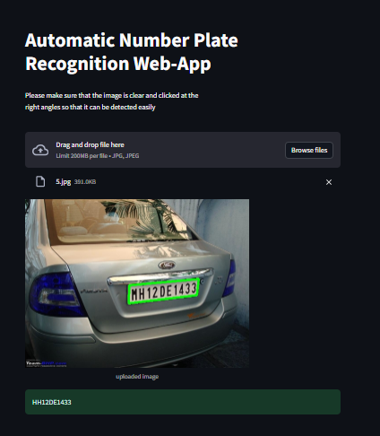

# ANPR_Tera

- Automatic Number Plate Recognition System is license plate identification system made using OpenCV and Tesseract OCR in python. For this project, It can be used to detect number plate from image.
- Creating an Automatic Number Plate Recognition System with OpenCV image processing and OCR is related to the need for technological solutions to increase efficiency and security in
various contexts, such as traffic monitoring, restricted area security, and parking management

## How it works?
1. Image Acquisition
   - The first step is to obtain an image containing a car or a scene where license plates need to be detected. This image can come from various sources, such as cameras or static image files.
2. Preprocessing:
   - The acquired image need preprocessing to enhance features relevant to license plate detection. Common preprocessing steps include resizing, converting to grayscale, and applying image filters (e.g., Gaussian blur) to reduce noise.
3. Edge Detection:
   - Edge detection algorithms, such as the Canny edge detector, applied to highlight prominent edges in the image. License plates often have distinct edges that can be detected through changes in intensity.
4. Contour Detection:
   - Contours are the boundaries of objects in an image. By identifying contours in the edge-detected image, potential regions of interest (ROI) that may contain license plates can be identified.
5. Filtering Contours:
    - Not all detected contours are relevant to license plates. Some contours may correspond to noise or irrelevant objects. Filtering criteria, such as aspect ratio, size, and shape, can be applied to eliminate unwanted contours and narrow down the search.
6. Characteristics of License Plates:
    - License plates typically have specific characteristics, such as a rectangular shape and a specific aspect ratio. These characteristics can be used to filter out false positives further.
7. Text Recognition -- Tesseract OCR:
    - optical character recognition (OCR) techniques applied to recognize and extract the characters on the plate.
8. Output or Visualization:
    - The final step involves either visualizing the detected license plates on the original image or storing the coordinates of the detected plates for further processing.

## The Web-App -- https://anpr-tera-zefanyadita.streamlit.app/

